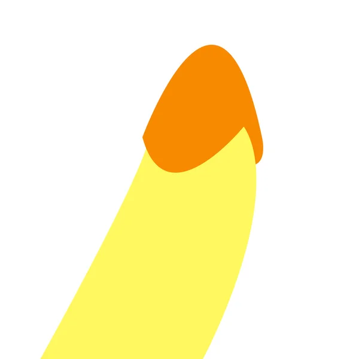

<html lang="hu">
<head>
    <meta charset="UTF-8">
    <meta name="viewport" content="width=device-width, initial-scale=1.0">
    <title>Szerencsekerék</title>
    
</head>
<body>
    

        

        
        <button id="spin-button" onclick="spinWheel()">Pörgetés</button>
        

    

    
</body>
</html>
